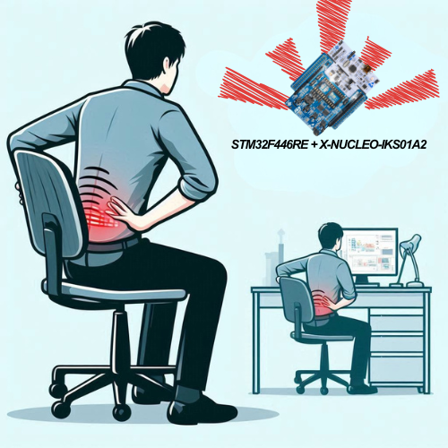
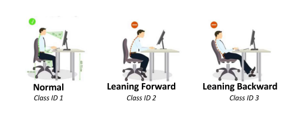

# SeatedAI: Classification for Alerting Bad Sitting Posture at the Desk

## Objective

The goal of this project is to **detect and alert** bad sitting posture at the desk using an embedded system based on the **STM32F446RE**. The system uses an **SVM model** to classify sitting positions based on data collected from an accelerometer. The device is designed to alert the user if their posture is incorrect, in order to prevent pain or disorders caused by prolonged improper sitting.

### **Classification Classes**:
The system classifies the sitting posture into the following three categories:

- **`Class 1`**: Normal  
   The user is sitting correctly, maintaining a healthy and proper posture.

- **`Class 2`**: Too Leaned Forward  
   The user is leaning too much forward, which could cause strain on the lower back and neck.

- **`Class 3`**: Too Leaned Backward  
   The user is leaning too much backward, which can also lead to discomfort or posture-related issues.

### **Hardware Overview**:
- **STM32F446RE**: The microcontroller used for data processing and classification.
- **X-NUCLEO-IKSO1A2 Expansion Board**: This expansion board is equipped with an accelerometer (LSM303AGR) to capture motion data.
- **LSM303AGR Accelerometer**: A 3-axis accelerometer used to monitor the user's movement.

### **How it Works**:
1. The **LSM303AGR accelerometer** mounted on the **back** of the user collects data on their posture.
2. The system processes the data using an **SVM model** (trained with NanoEdge AI) to classify the sitting position into one of the three **`classes`**: **Normal**, **Too Leaned Forward**, or **Too Leaned Backward**.
3. **NanoEdge AI** is used for the classification, with a minimal memory footprint: **0.3 KB RAM** and **0.5 KB Flash**.
4. If the posture is detected as abnormal (either too leaned forward or backward), the system can trigger an alert to notify the user.

### **Images**:

#### Project Overview
  
*An overview of the project setup.*

#### Posture Classification
  
*Illustrates the three classes of posture:  
`Class 1` - Normal,  
`Class 2` - Too Leaned Forward,  
`Class 3` - Too Leaned Backward.*

---

### **Project Setup**:
1. **Hardware Required**:
   - STM32F446RE Development Board.
   - X-NUCLEO-IKSO1A2 Expansion Board (with LSM303AGR accelerometer).
   
2. **Software**:
   - **[STM32CubeIDE](https://www.st.com/en/development-tools/stm32cubeide.html)** for programming the STM32F446RE.
   - **[NanoEdge AI Studio](https://www.st.com/en/development-tools/nanoedgeaistudio.html)** for creating and training the classification model.
   
3. **Connections**:
   - The accelerometer (LSM303AGR) is connected to the STM32F446RE via the I2C interface on the X-NUCLEO-IKSO1A2 expansion board.

---

### **Memory Usage**:
- **RAM**: 0.3 KB
- **FLASH**: 0.5 KB

This system is highly optimized for low memory usage, making it ideal for embedded applications like this posture detection system.

---

### **How to Use**:

1. Clone this repository:

    ```bash
    git clone https://github.com/Rush2Fer/SeatedAI.git
    cd SeatedAI
    ```

2. Open the project in **STM32CubeIDE** and flash it to your STM32F446RE development board.

3. Connect the **X-NUCLEO-IKSO1A2 Expansion Board** to the STM32F446RE and power the system.

4. After starting the system, it will begin classifying the user's sitting posture based on data from the **LSM303AGR accelerometer**.

5. If the posture is classified as abnormal (either too leaned forward or backward), the system will alert the user.

---
